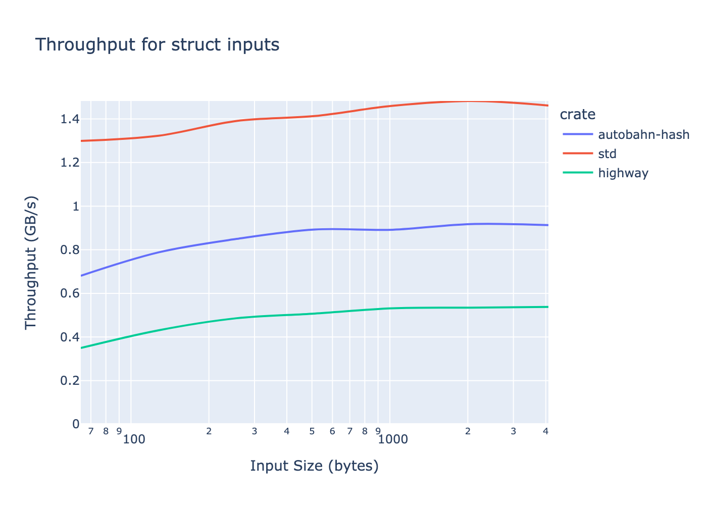

AutobahnHash
============

A pure Rust implementation of [HighwayHash](https://github.com/google/highwayhash).

A few highlights:
* No `unsafe`
* Fuzzed against the reference implementation
* Minimal crate with few required dependencies
* Portable to any SIMD instruction set (and reasonably fast without SIMD)

This crate requires the `portable_simd` nightly feature.

## Benchmarks
The following benchmarks were done on an Intel i7-9750H, to give an idea of the performance profile.
These two benchmarks can help predict best- and worst-case performance.

### Slices
The HighwayHash algorithm performs best on long slices of data:

### Non-slice data
Worst-case performance is can be predicted with non-slice data: `struct Data(u8, u16, u32, u64);`

## License
AutobahnHash is distributed under the terms of both the MIT license and the Apache License (Version 2.0).

See [LICENSE-APACHE](LICENSE-APACHE) and [LICENSE-MIT](LICENSE-MIT) for details.
